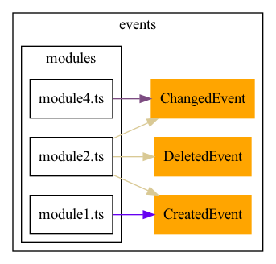

# Typescript class usage graph
Finds usages of a typescript classes in your project

## Getting started
1. Install graphviz (https://www.graphviz.org/download/)
2. Install packages `npm install`
3. Run `ts-node index.ts`

## Example

